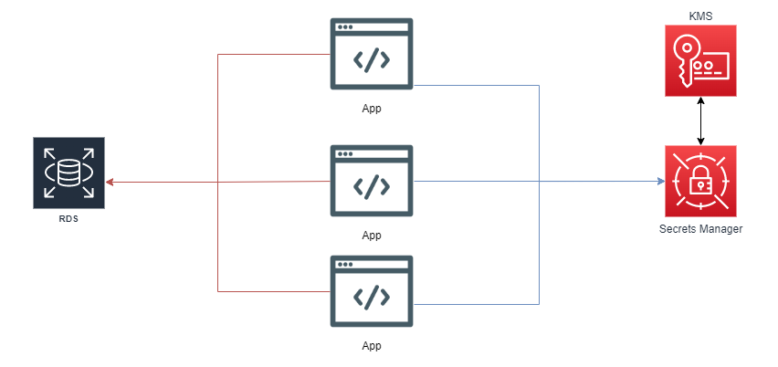

# mod-aws-cdk-secret-manager

[](https://docs.aws.amazon.com/cdk/v2/guide/getting_started.html)

> Module that allows the creation of Screts in SecretManager and its dependencies.

>
> ## Table of Contents

- [mod-aws-cdk-secret-manager](#mod-aws-cdk-secret-manager)
  - [Table of Contents](#Table-of-Contents)
  - [Diagram](#Diagram)
  - [Prerequisites](#Prerequisites)
  - [Providers](#Providers)
  - [Inputs](#Inputs)
  - [Outputs](#Outputs)
  - [Example usage](#Example-usage)
  - [Basic Invocation Example](#Basic%20Invocation%20Example%20with%20one%20Secret)
  - [Custom Invocation Example](#Custom%20Invocation%20Example%20with%202%20or%20more%20Secrets)

## Diagram



## Prerequisites

You will need the following things properly installed on your computer.

- [Git](http://git-scm.com/)
- [Node](https://nodejs.org/en/download)
- [npm](https://docs.npmjs.com/downloading-and-installing-node-js-and-npm)
- [CDK](https://docs.aws.amazon.com/cdk/v2/guide/getting_started.html#getting_started_install)
- [JavaScript](https://developer.mozilla.org/es/docs/Web/JavaScript)

## Requirements


## Providers

| Name | Version |
| ---- | ------- |
|   |      |

## Inputs

| Name                  | Description                              | Type     | Default | Required |
| --------------------- | ---------------------------------------- | -------- | ------- | :------: |
| Name                  | Custom Secret Name.                      | `string` | n/a     |   yes    |
| description           | Custom Description for Secret.           | `string` | n/a     |   yes    |
| secret                | Custom String List for Secret.           | `string` | n/a     |   yes    |


## Outputs

| Name  | Description                                 |
| ----- | ------------------------------------------- |
|  |  |

## Example usage

- This module allows the creation of one or more parameters as necessary.


### Basic Invocation Example with one Parameter

```CDK
Add in package.json

"dependencies": {
    "aws-cdk-lib": "latest",
    "constructs": "latest",
    "secretManagerModule": "gitlab:mauriciogonzalezferia/mod-aws-cdk-secret-manager"
  }

#################################################################

const cdk = require('aws-cdk-lib');
const ssm = require('aws-cdk-lib/aws-ssm');
const { secretManagerModule } = require('../../mod-aws-cdk-secret-manager/secret-manager-module');

// Your Custom Stack
class CdkSSMStack extends cdk.Stack {
  constructor(scope, id, props) {
    super(scope, id, props);

    // Inside your custom stack
    // Create Secret on SecretManager
    new secretManagerModule(this, 'CustomServiceName', {
      Name: 'Custom Secret Name'
      description: 'Custom Description for the Secret'
      secret: {
        key1: 'Custom Value',
        key2: 'Custom Value',
      }
    });
  }
}

module.exports = { CdkSSMStack };   // Your Custom Stack

```

### Custom Invocation Example with 2 or more Secrets in one

```CDK
Add in package.json

"dependencies": {
    "aws-cdk-lib": "latest",
    "constructs": "latest",
    "secretManagerModule": "gitlab:mauriciogonzalezferia/mod-aws-cdk-secret-manager"
  }

#################################################################

const cdk = require('aws-cdk-lib');
const ssm = require('aws-cdk-lib/aws-ssm');
const { secretManagerModule } = require('../../mod-aws-cdk-secret-manager/secret-manager-module');

// Your Custom Stack
class CdkSSMStack extends cdk.Stack {
  constructor(scope, id, props) {
    super(scope, id, props);

    // Inside your custom stack
    // Create Secret on SecretManager
    new secretManagerModule(this, 'CustomServiceName', {
      Name: 'Custom Secret Name'
      description: 'Custom Description for the Secret'
      secret: {
        key1: 'Custom Value Key 1',
        key2: 'Custom Value Key 2',
        username: 'yourCustomUser',
        password: 'yourCustomPassword',
        host: 'db.example.com',
        port: 3306,
        dbname: 'mydatabase',
        apiKey: 'myApiKey123456',
        apiSecret: 'myApiSecret7890',
        endpoint: 'https://api.example.com',
      }
    });
  }
}

module.exports = { CdkSSMStack };   // Your Custom Stack

```

